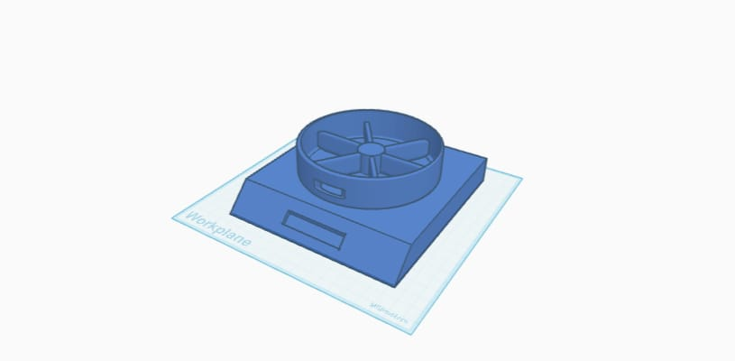
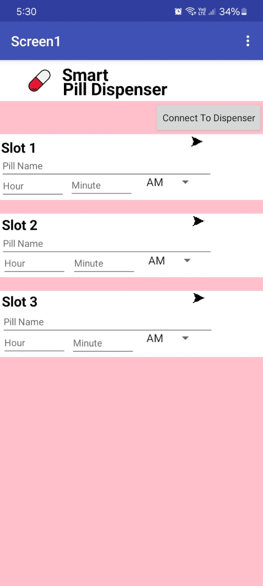

# 💊 Smart Pill Dispenser System

An IoT-based Smart Pill Dispenser developed using ESP32 to automate medication reminders and pill dispensing.

---

## 🚀 Features
- RTC-based pill scheduling
- Bluetooth mobile app setup
- Servo motor controlled tray
- LCD display for instructions
- LED & buzzer alerts
- Push-button acknowledgment

---

## 🛠️ Technologies Used
- ESP32
- RTC DS3231
- Servo Motor
- LCD I2C
- Arduino IDE
- MIT App Inventor
- Bluetooth Serial Communication

---

## 📸 Project Images

### 🔹 3D Model

### 🔹 Prototype
![Prototype].(prototype.jpeg)

### 🔹 Mobile App Interface

---

## 🎥 Project Demo & LinkedIn Post

🔗 [Watch the Project Demo on LinkedIn](https://www.linkedin.com/posts/yogavelan-m-d-499b52312_smartpilldispenser-healthcareinnovation-esp32-activity-7344581351569813504-sA_2)

---

## 👨‍💻 Developed By
- Yogavelan M D
- Santhosh
